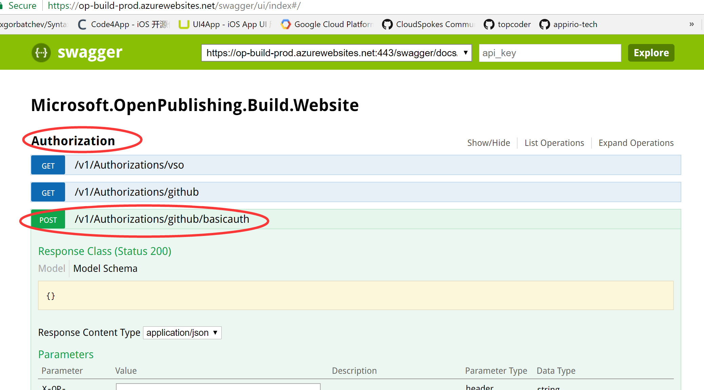
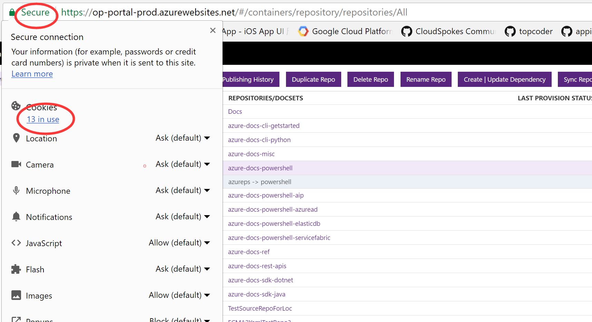
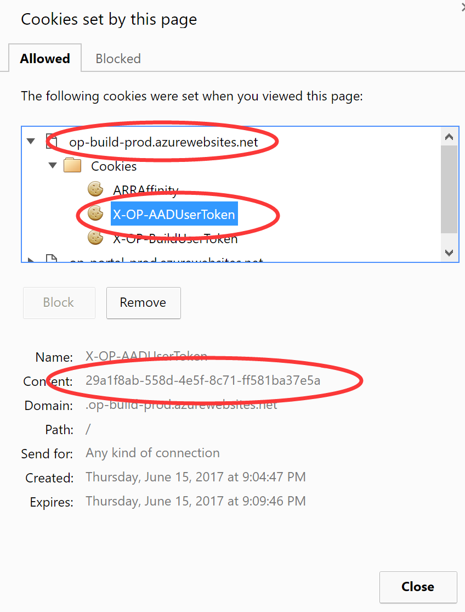

### How to get a long period op build token for api request.
Use chrome to go to the [swagger site]( https://op-build-prod.azurewebsites.net/swagger/ui/index#/), open the **"Authorization"** tab and the **"POST /v1/Authorizations/github/basicauth"** tab as below pitcure. There are 3 parameters should be filled.

###### 1. X-OP-githubOtp: 
it's the github two-factor code, if you enable the github two-factor, you should fill this, or you can skip it.

###### 2. Authorization: 
this a basic auth token of your github account and github password, you can use [some tool](https://partychen.github.io/basic-authentication-header-generator.html) to generate it.
> the format should like "Basic Z2l0aHViX2FjY291bnQ6Z2l0aHViX3Bhc3N3b3Jk"

###### 3. X-OP-AADUserToken: 
this is the add token, it make sure you are a microsoft user and can pass the company AAD.

* Use chrome then go to the [portal](https://op-portal-prod.azurewebsites.net), login with github.(if you already login, please logout first.)

* Go back to the [swagger site]( https://op-build-prod.azurewebsites.net/swagger/ui/index#/), now you can leave this parameter to empty.

Click **"Try it out!"**, if succeed, you will get the op-build-token.

> If repsonse message is "AAD authentication credential is missing or incorrect.", you can go through below steps to obtain manually.

> * Use chrome then go to the [portal](https://op-portal-prod.azurewebsites.net), login with github.(if you already login, please logout first.)

> * After login the portal, click the **Secure** in the top left of browser, you can see it like below. then click the **cookie** link.
> 

> * Click to view the **X-OP-AADUserToken**, and copy it's content.
> 
